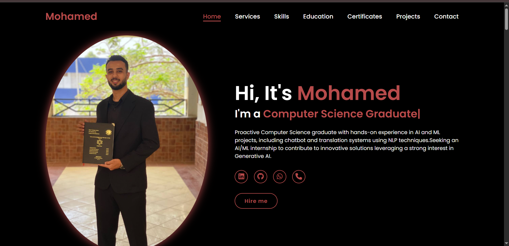

# Personal Portfolio Website

This repository contains the source code for my personal portfolio website, built from scratch to showcase my skills, education, and projects in AI, Machine Learning, and Computer Science.

**[View Live Demo](https://mohamedelgenidy.github.io)**

## 📸 Preview



## 🛠️ Technologies Used

This project is built using foundational web technologies:

* **HTML5:** For the structure and content of all sections.
* **CSS3:** For all custom styling, layout (Flexbox), and responsiveness.
* **JavaScript (ES6+):** For interactivity, DOM manipulation, and all dynamic features.

## ✨ Key Features

The JavaScript file (`script.js`) implements several key interactive features:

* **Responsive Design:** The layout adapts to all screen sizes, from mobile to desktop, using media queries.
* **Dynamic Typing Animation:** A "typing" effect on the homepage headline using the **Typed.js** library.
* **Active Link on Scroll:** The navigation bar automatically highlights the section the user is currently viewing.
* **Sticky Header:** The navigation bar locks to the top of the page when the user scrolls down.
* **Mobile-Friendly Menu:** A "hamburger" icon that toggles the navigation menu on small devices.

## 🚀 How to Run

1.  Clone this repository:
    ```bash
    git clone [https://github.com/mohamedelgenidy/your-repo-name.git](https://github.com/mohamedelgenidy/your-repo-name.git)
    ```
2.  Open the `index.html` file in your local web browser.

## 📞 Contact

All professional and contact information (LinkedIn, GitHub, WhatsApp) is available directly on the website.
